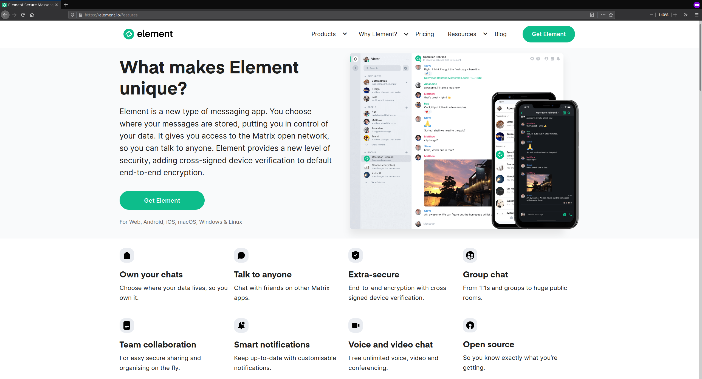

# Installation of a client / program

To connect to the Matrix federation, you will use a client. The recommended
client for using Matrix is called Element[^1] and it is free to use. Element is
the official client developped by the Matrix core team and the only one we
officially support. It can be used on different systems and devices:

1. **Element Web:**
   [The browser web application provided by the OSUM team](#web-app)
1. **Element Desktop:** [Downloads for Linux/Windows/Mac](#desktop-app)
1. **Element mobile:** [Android/iOS](#mobile-app)

## Element Web {#web-app}

The easiest way is to use Matrix is to open the Element Web application directly
in your favorite modern browser (for example
[Mozilla Firefox](https://www.mozilla.org/firefox/)).

Web-App:
{}chat.openscience.ca{}

Further information can be found in the section ["Element Web
(Browser)"]( "Element Web (Browser)").

## Element Desktop {#desktop-app}

We recommended that you install Element on your own computer for practicality
purposes. You will have access to your conversations without having to open a
browser (however, you will have to update Element from time to time, like any
other program).

Downloads for:
{{% button href="https://packages.riot.im/desktop/install/win32/x64/Element%20Setup.exe" icon="fas fa-download" %}}Windows{}
{}macOS{}
{}Linux{}

More information can be found in the submenu ["Element
Desktop"]( "Element Desktop").

## Element Mobile {#mobile-app}

To have access to Matrix anywhere you go, you can install the Element Mobile
client on your smartphone.

<!-- prettier-ignore -->
Downloads for:
{}Android (Google Play){}
{}iOS (iPhone/iPad){}
{}Android (F-Droid){}

Further information can be found in the submenu ["Element
Mobile"]( "Element Mobile").

## Other clients

If you are familiar with such technologies, you may be tempted to use one of the
[many clients](https://matrix.org/clients/) developped by the community. Note
that we will probably not be able to help you if you encounter bugs on other
clients than Element. Refer to the [Other
clients]({}) section for more information.

[^1]: Element was formerly known as Riot.im before it became Element.
